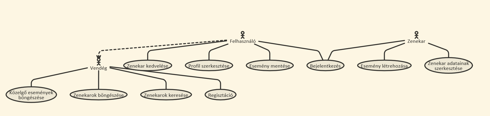
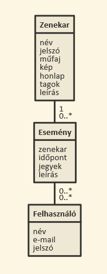
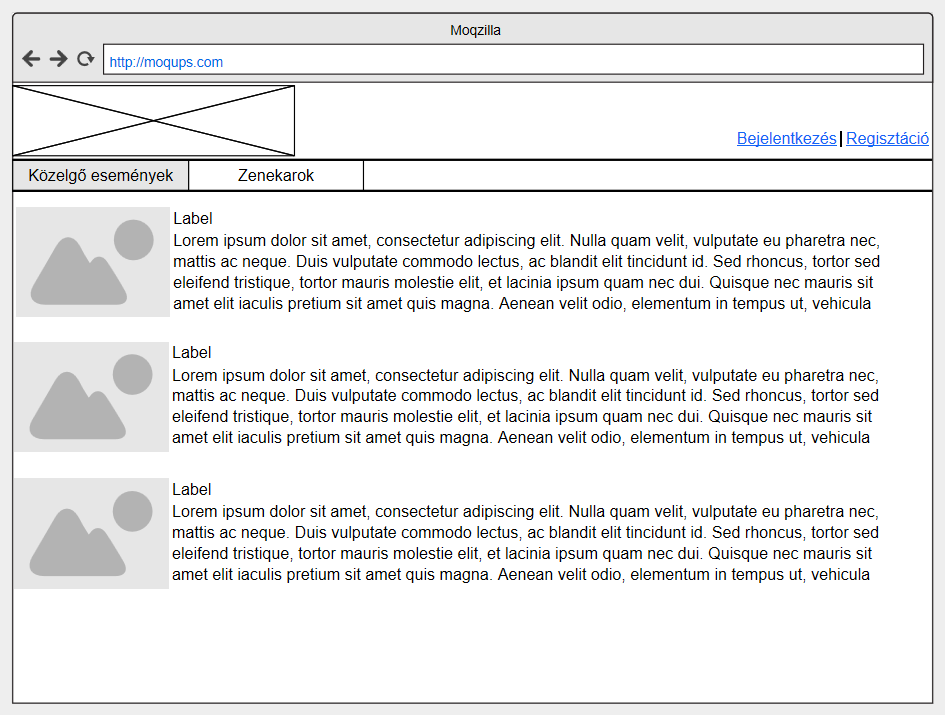
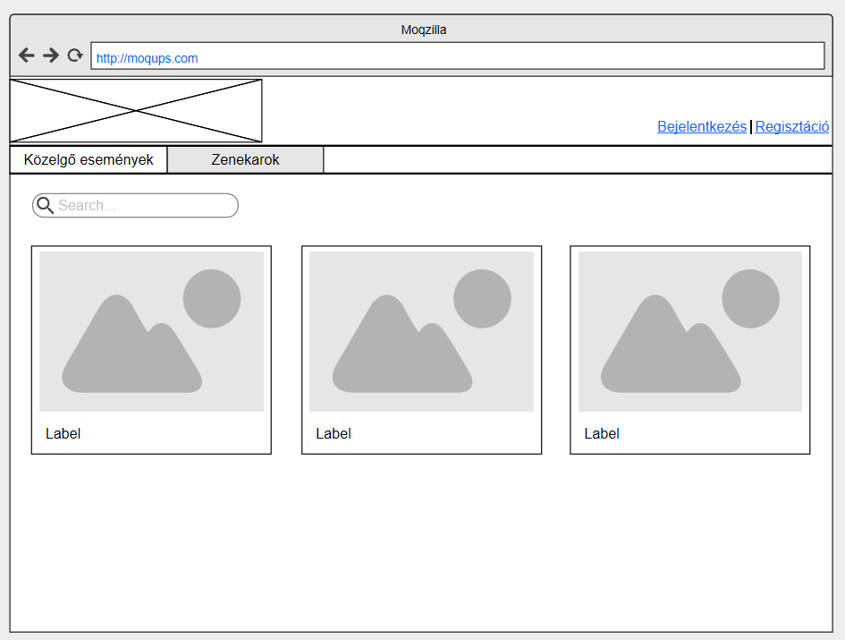
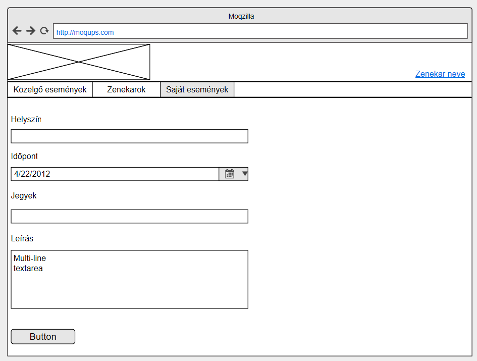

#Dokumentáció
##Közelgő események

###Követelményanalízis

**Célkitűzés, projektindító dokumentum**
 
A program legfőbb célja, hogy a felhasználók egy helyen értesüljenek kedvenc zenekaraik fellépéséről egy webes vastagkliens, azaz        egyoldali alkalmazás felhasználásával Az adatok védelme érdekében legyen lehetőség regisztrációra, majd bejelentkezésre. Bejelentkezett   felhasználó megjelölheti kedvenc zenekarjait, elmentheti az eseményeket. Bejelentkezett zenekarként lehetőség van új esemény létrehozására 

**Funkcionális követelmények:**
-Regisztráció
-Bejelentkezés
-Csak bejelentkezett felhasználók által elérhető funkciók
  -zenekar megjelölése
  -események mentése
  -események listázása kedvenc zenekarokra szűrve

**Nem funkcionális követelmények:**
*Könnyű áttekinthetőség: Színekkel típus szerint csoportosítás 
*Használhatóság: Könnyű áttekinthetőség, ésszerű elrendezés, könnyen kezelhetőség 
*Megbízhatóság: jelszóval védett funkciók, és a jelszavak védelme a háttérben. Hibásan bevitt adatok esetén a program jól láthatóan jelezzen a felhasználónak, és emelje ki a hibás beviteli mezőket. A jól bevitt adatok maradjanak az űrlapban. 
*Karbantarthatóság: könnyen lehessen bővíteni, a különböző típusú fájlok külön csoportosítva, ésszerűen legyenek felbontva, a könnyebb fejleszthetőség miatt

**Használatieset-modell, funkcionális követelmények**

###Tervezés

**Architektúra terv**

**Oldalvázlatok:**

Közelgő események:

Zenekarok:

  
Új esemény hozzáadása:

